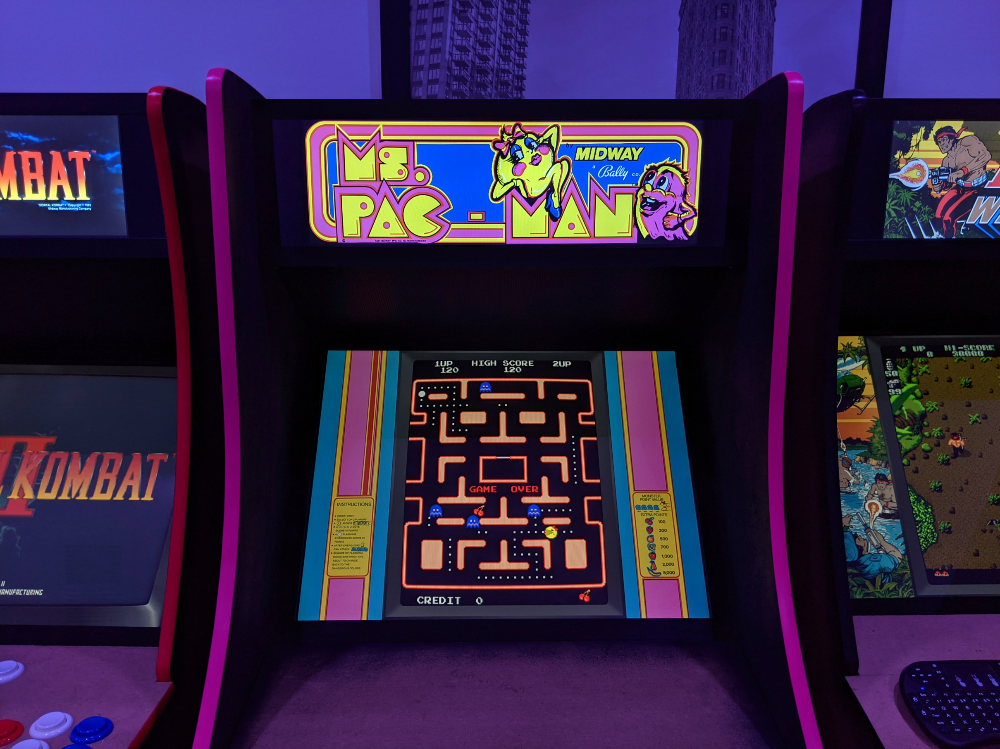
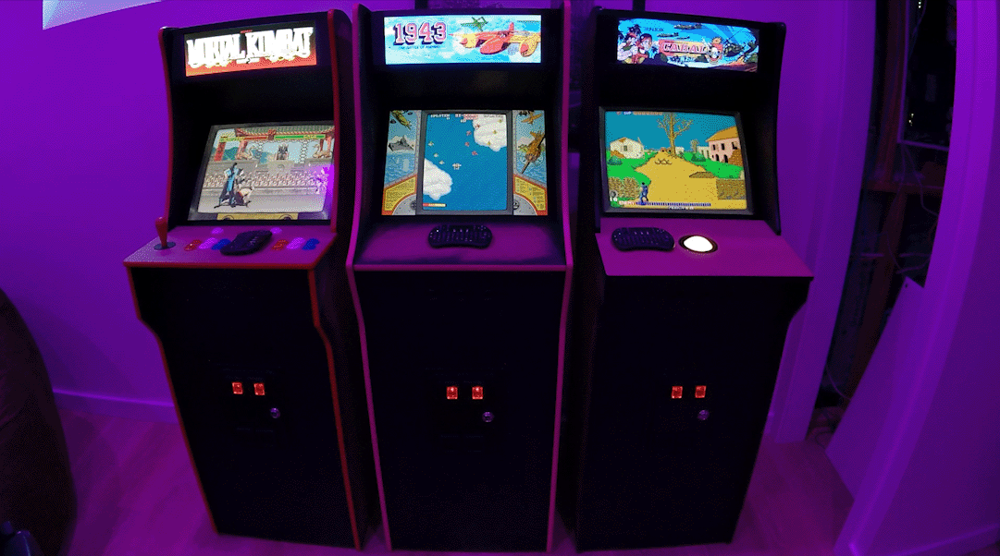

*Cabinet by Justin Fite*

# PieMarquee2 Supreme Edit
Enhanced Marquee plugin for RetroPie, With edits made from the spreme team.

**Whats new?**
1)New supreme team marquee script to control marquee location as well as a easy on and off option, With outo gamelist entry built.
2)Boot up video will be the same as your splash screen.
3)Outo HDMI marquee detection .
4)Marquee VIEWER will now be outo full screen.

original code by RiNa from raspigamer forum (https://cafe.naver.com/raspigamer/)   
https://github.com/rinalim/PieMarquee2

## Install
```
cd /home/pi
git clone https://github.com/SupremePi/PieMarquee2.git
cd PieMarquee2
chmod 755 ./install.sh
./install.sh
```
If you use different display as second monitor, You may need to change framebuffer resolution.  
Add this line to /opt/retropie/configs/all/autostart.sh  
`fbset -fb /dev/fb0 -g 1280 720 1280 720 16`

## PieMarquee2 integrated EmulationStation
You can use PieMarquee2 in ES gamelist screen
```
cd /home/pi/PieMarquee2
chmod 755 ./install-pi4es.sh
./install-pi4es.sh
```
**NOTE :** Pi4 only. It will overwrite original ES

**What you need for Marquee** 

  * Default marquee file is "**maintitle.png**" in "`/home/pi/PieMarquee2/marquee/system/`" folder  
  
  * You can set default marquee as video.  
    Copy video file "**maintitle.mp4**" to "`/home/pi/PieMarquee2/marquee/system/`" folder (*optional*)
    
  * (OLD LOACTION) Main Marquee image for each game should be in "`/home/pi/PieMarquee2/marquee/[system name]/[gamefilename.png]`"   
    **Note**: fba, mame-advance, mame-libretro and mame-mame4all will share the system folder name as `arcade`  
    (eg: for galaga in fba folder - /home/pi/PieMarquee2/marquee/arcade/galaga.png  
         for mario.zip in nes folder - /home/pi/PieMarquee2/marquee/nes/mario.png )

  * (NEW LOACTION) Main Marquee image's for each game will show from the folder you pick using the supreme marquee script.
ex:
```
/home/pi/RetroPie/roms/[system name]/themed-marquee 
/home/pi/RetroPie/roms/[system name]/marquee
/home/pi/RetroPie/roms/[system name]/mixar
/home/pi/RetroPie/roms/[system name]/boxart
/home/pi/RetroPie/roms/[system name]/wheel
``` 
         
  * If there is no game marquee file then PieMarquee2 will show system marquee.  
    Place for system marquee "**systemname.png**" is "`/home/pi/PieMarquee2/marquee/system/`" folder  
    (eg: **snes** for super nintendo, **megadrive** for genesis and megadrive )
    
  * Video boot intro can be set. Copy video file "**intro.mp4**" to "`/home/pi/PieMarquee2/`" folder (*optional*)
  
  * instruction panel image for each game "**gamefilename.png**" goes to "`/home/pi/PieMarquee2/marquee/instruction`" folder (*optional*)
  * publisher image for publisher "**publishername.png**" goes to "`/home/pi/PieMarquee2/marquee/publisher`" folder (*optional, defined in gamelist_short.xml* )  
    **NOTE :** Setting instruction or publisher images makes PieMarquee2 to show marquee of game, instruction and publisher sequentially.)

**Big thanks to orgianl creator rinalim and edits made from losernator. Also thanks to the Supreme team and Viet for the new marquee edits.**